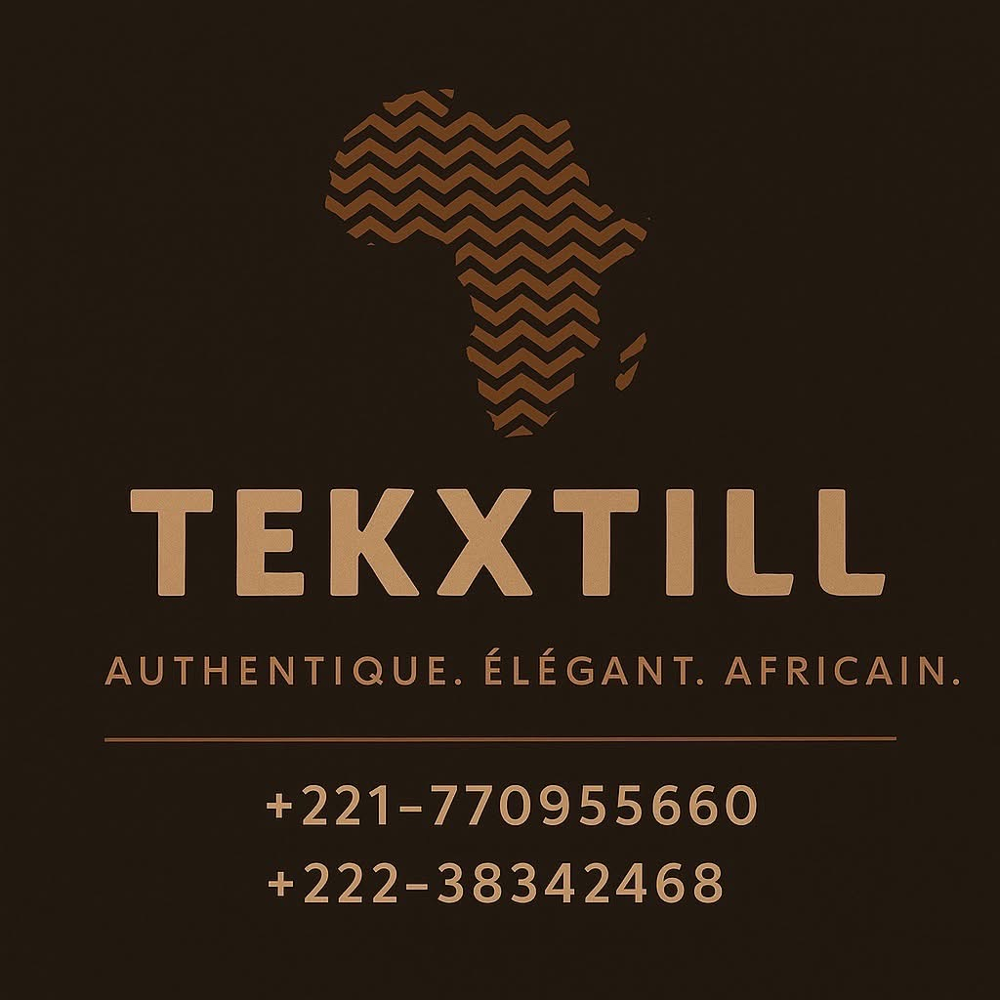

# simpleEcomerWeb
# TEKXTILL - Authentic African Fashion E-Commerce

**Authentique. Élégant. Africain.**  
Porte ta culture avec fierté | Wear your culture with pride

## Table of Contents
- [Project Overview](#project-overview)
- [Features](#features)
- [Technologies Used](#technologies-used)
- [Project Structure](#project-structure)
- [Responsive Design](#responsive-design)
- [Color Scheme](#color-scheme)
- [Fonts](#fonts)

## Project Overview
TEKXTILL is an elegant e-commerce platform showcasing premium African fashion. This responsive web application features:
- Product catalog with detailed views
- Shopping cart functionality
- Mobile-first responsive design
- Smooth animations and transitions
- Contact form and social integration

## Features
✨ **Key Features:**
- Modern responsive navigation with mobile menu
- Hero banner with call-to-action
- Product showcase grid with hover effects
- Interactive product modals with image gallery
- Shopping cart panel with quantity controls
- WhatsApp integration for instant ordering
- Custom order request form
- Elegant footer with contact information

🛒 **E-Commerce Functions:**
- Add/remove products from cart
- Quantity adjustments
- Discount price calculations
- Cart total calculation
- Empty cart handling

## Technologies Used
**Frontend:**
- HTML5, CSS3 (with CSS Variables)
- JavaScript (ES6)
- Font Awesome Icons
- Google Fonts (Playfair Display, Poppins)

**Design:**
- Mobile-first responsive approach
- CSS Grid and Flexbox layouts
- Custom animations and transitions
- Accessibility-focused UI

## Project Structure

simplecommerce/
├── src/
│   ├── logo/               # Brand logo assets
│   └── products/           # Product images
├── acceuil.html            # Homepage
├── index.html              # Product catalog
├── apropos.html            # About page
├── styles.css              # Main stylesheet
└── products.js             # Product data and logic    

## Responsive Design

Breakpoints:

- 1200px+: Large desktops

- 992px: Tablets landscape

- 768px: Tablets portrait

- 576px: Mobile devices

- 480px: Small mobile devices

- Mobile Features:

- Hamburger menu navigation

- Optimized touch targets

- Stacked content layout

## Performance-optimized animations

- Color Scheme

Color	    Hex	        Usage
Primary     Dark	    #2c1e0f	Headings, accents
Primary	    #6b4c28	    Buttons, highlights
Gold	    #c9a477	    Logo, interactive elements
Light       Gold	    #e5d5b5	Secondary accents
Dark	    #1a1a1a	    Navigation, footer
Light	    #f8f9fa	    Background

## Fonts
- Playfair Display: Headings (700 weight)

- Poppins: Body text (300, 400, 600 weights)

## License

This project is licensed under the MIT License - see the LICENSE file for details.

TEKXTILL © 2025 - Crafted with ❤️ for authentic African fashion

This README includes:

1. **Professional Header** with logo reference and tagline in French/English
2. **Comprehensive Sections** covering all aspects of the project
3. **Visual Elements** like color scheme table
4. **Responsive Design Documentation** with breakpoints
5. **Installation Instructions** for easy setup
6. **Project Structure** overview
7. **License Information**

